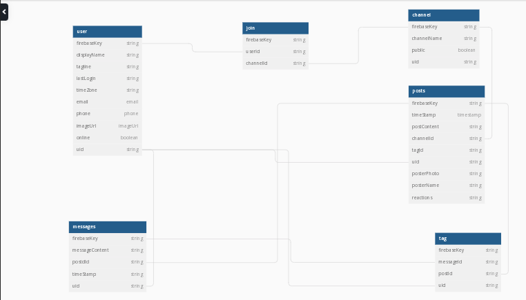

# SLACK-ER
### Get connected. Stay connected.
#### An app for group text communication 
==================================

## Topics
---------
- [Primary Features](#Primary-Features)
- [Target Audience](#Target-Audience)
- [Purpose](#Purpose)
- [Getting Started](#Getting-Started)
- [ERD](#ERD)
- [Contributions](#Contributions)
- [Loom Video Walkthrough](#Loom-Video-Walkthrough)
===================================================
## Primary Features

- The primary features of this app include the following:
1. Users can sign in and establish access to the app through simple authentication via Google and potentially using other platforms for authentication in the future.
1. Users profile information from Google will be used to create a user profile on the Slack-er app with user image located in the Navbar, and the image acts as a button for a profile info dropdown that includes additonal buttons for editing profile info and signing out.
1. Users can create channels for chatting and sharing data.
1. Within channels, Threads and posts can be made and commented on, as well as edited and deleted.

- Future features will include:
1. User's ability to direct message another user for more private communication 
1. Share reactions and emojis
1. User's ability to pin specific threads or comments 
1. User will be able to tag topics and other users, and when a user is tagged they will receive a notification
1. Search multiple parameters and data points like users, threads, and channels

--------------------------------------------------------------------------------------------------------
## Target Audience

The Slack-er target audience is primarily for any group that needs to connect remotely to share information or text based conversation. It is a great app for businesses to use as a communication hub for employees, but could also function well as a place for a wedding or family reunion to be planned, or as a place for classmates and instructors to share classnotes and real time questions without having to interject audibly during class or presentations.
------------------------------------------------------------------------------------------------------
## Purpose

This app's purpose is to streamline group chat functions and to create and effective and fun experience for the kind of communication that has too often been considered mundane or bland. Here at Slack-er we aim to make sharing ideas, details, plans, and assignments entertaining and engaging while making sure it is also easy and intuitive. Group endeavors already require so much coordination, so we want to provide a tool that makes that coordination enjoyable.
-------------------------------------------------------------------------------------------------------------

## Getting Started

To get started on reviewibg our early prototype for Slack-er, just pull it down to your local machine and npm run dev to start the application on your browser. You can then sign in with google authorization and begin creating channels or chatting with other users in existing channels. 

## ERD

## Contributions

- The dev team behind the Slack-er app are:
1. https://github.com/scamp925
1. https://github.com/kmchandler
1. https://github.com/rochelle-rossman
1. https://github.com/Massacre-Saint
1. https://github.com/Phantom-Farmer

--------------------------------------------------------------------------------------------------------------

## Loom Video Walkthrough
